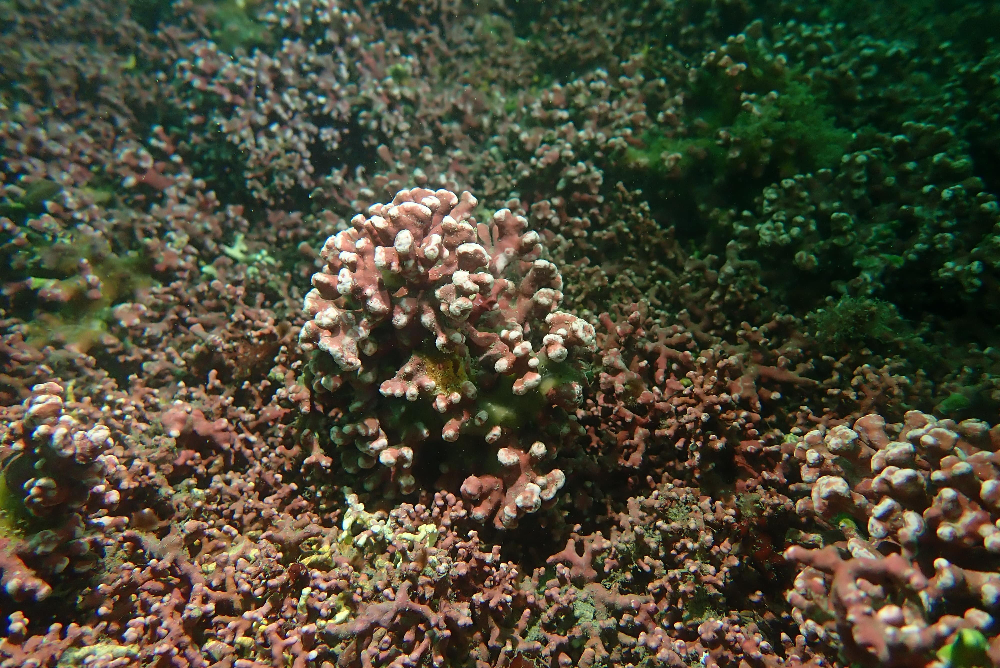

# Population genomics, polyploidy, climate resilience and the microbiota of two habitat-building coralline algae

This repository contains the code and supporting data used in this study.

**Reference**  
TBC

**Species studied**
- _Phymatolithon calcareum_
- _Lithothamnion corallioides_

 

