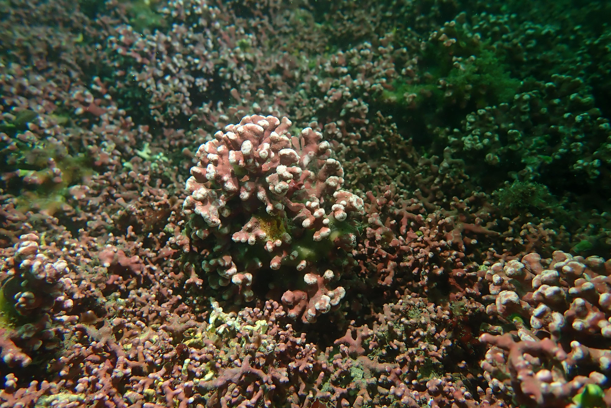

# Using population genomics to inform conservation of habitat-building coralline algae under climate change

This repository contains the code and supporting data used in this study.

**Reference**  
Population Genomics Informs Resilience and Vulnerability of Habitat-Building Coralline Algae. 2025. _Evolutionary Applications_. 18, 11.
https://doi.org/10.1111/eva.70179

**Species studied**
- _Phymatolithon calcareum_
- _Lithothamnion corallioides_

 

